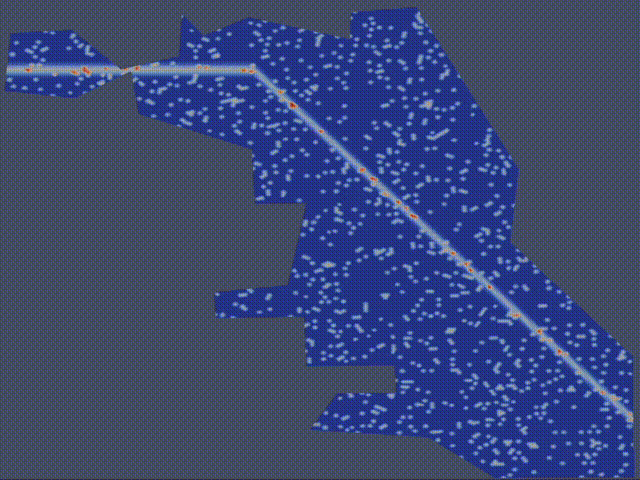

# CrimeFEM: A Finite Element and Agent-Based Modeling Framework for Urban Crime Dynamics



This repository provides the code accompanying the paper:

> *A finite element framework for simulating residential burglary in realistic urban geometries*  
> (Authors, Year)

It contains:
- Two **finite element solvers (Python)** for the PDE mean-field model.
- An **agent-based model (MATLAB)** representing individual criminal motion.
- Tools for data analysis, and visualization.

---

## Model Overview
We simulate the evolution of the *attractiveness field* and *criminal density* over realistic city geometries,
derived as a mean-field limit from an underlying agent-based process.
The PDE model resembles a nonlinear Keller–Segel system with Neumann-type boundary conditions.

---

## Repository Structure
- `src/pde_model/`: Python FEM implementation.
- `matlab_abm/`: Agent-based MATLAB code.
- `notebooks/`: Reproducibility and visualization notebooks.
- `data/`: Input data (urban maps, parameters, etc.).
- `results/`: Simulation outputs.
- `docs/`: Documentation and model derivations.

---

## Installation

### Python (FEM)
```bash
conda env create -f environment.yml
conda activate crimefem
