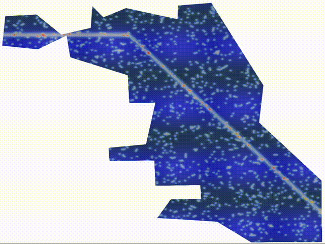

# CrimeFEM: A Finite Element and Agent-Based Modeling Framework for Urban Crime Dynamics
<div align="center">
  
</div>

This repository provides the code accompanying the paper:

**A finite element framework for simulating residential burglary in realistic urban geometries**  
_Baoli Hao, Kamrun Mily, Annalisa Quaini, and Ming Zhong (2025)_  
arXiv: [2508.11055](https://arxiv.org/abs/2508.11055)


It contains:
- Two **finite element solvers (Python)** for the PDE mean-field model.
- An **agent-based model (MATLAB)** representing individual criminal motion.
- Tools for data analysis, and visualization.

---

## 0. Model Overview
We simulate the evolution of the *attractiveness field* and *criminal density* over realistic city geometries,
derived as a mean-field limit from an underlying agent-based process.
The PDE model resembles a nonlinear Keller–Segel system with Neumann-type boundary conditions.

---

## 1. Repository Structure
- `src/pde_model/`: Python FEM implementation.
- `src/agent_based_model`: Agent-based MATLAB code.
- `demo/`: Reproducibility and visualization notebooks.
- `data/`: Input data (urban maps, parameters, etc.).

---

## 3. Installation


### Python (FEM)
```bash
conda env create -f environment.yml
conda activate crimefem
